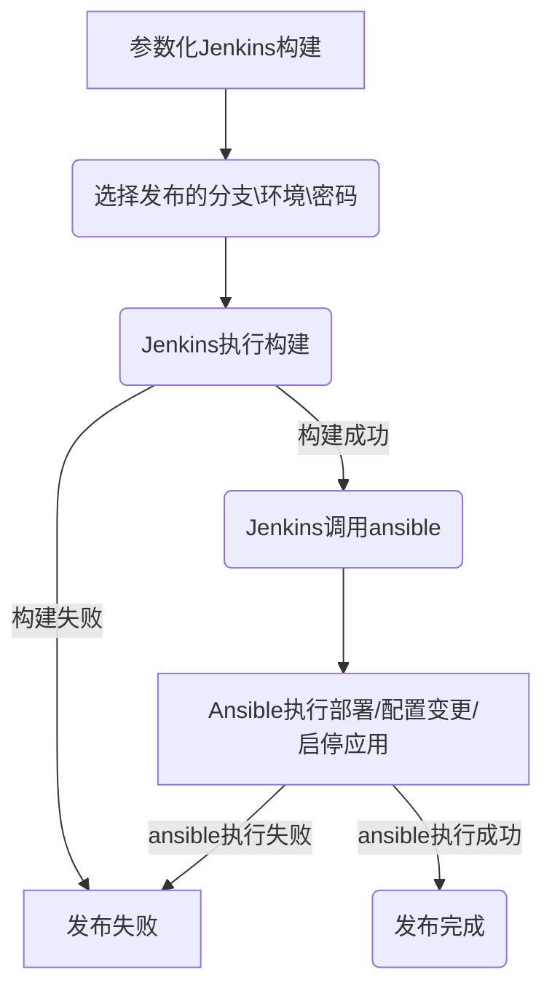

[TOC]

本文介绍基于springboot的java程序如何自动化部署。该CI/CD方案基于Jenkins+Ansible，可以快速在企业落地。不了解Ansible或者Jenkins都没有关系，你甚至只需要复制方案代码并录入你的资产，即可落实该CI/CD方案了。

> 不管你是开发者或者是运维人员，如果你满足以下条件的任一种，建议深度阅读此文：
>
> * 使用 scp 、winscp复制jar包到目标服务器
> * 使用nohup java foo.jar 启动应用程序
> * 写入/etc/rc.local 文件来开机启动
> * 使用shell脚本来批量发布
> * jvm参数都写在脚本里

本文将向你介绍一种适用于中小企业快速实现CI/CD的方案。你将了解到：

* jenkins同一个job发布多环境
* 应用启停如何实现系统托管
* 应用批量发布
* 应用滚动升级
* 每个jar包的jvm参数不同该如何管理
* 多环境下ansible资产如何管理
* 如何管控发布权限

## 工作流程

Jenkins主要负责构建工作，也就是生成好一个包、带上参数交给ansible，至于发布到哪个环境，哪些机器，应用重启都交给ansible去完成。



Jenkins接收构建的参数，如分支、要发布的环境、发布密码等，然后Jenkins进行构建，构建完成调用ansible并传入相关参数给ansible，ansible根据参数完成发布动作，ansible发布过程包括复制jar包到目标机器，生成jar包的启动文件，完成jar包的启停管理等。

## 准备

centos6/7 ，安装好Jenkins与ansible (jenkins与ansible在同一机器)

> #ansible 安装 
>
> yum install python-pip -y && pip install ansible 

本文中ansible的资产及playbook等文件都位于/root/ansible_data，ansible的配置文件内容如下：

```bash
cat /etc/ansible/ansible.cfg
[defaults]
host_key_checking = false
roles_path = /root/ansible_data/roles/
timeout = 5
forks = 50
```


## 环境资产组织

企业一般会分开发、测试、预发、生产这样的环境，要把应用发布到不同环境，首先要做的就是组织好这些环境。

> 假定环境简称按以下规则，每个公司的叫法不同，这里遵循自己公司规范即可
>
> 开发dev 测试test 预发uat 生产pro

资产都交给ansible进行管理，假定你已经安装并配置好ansible。我们这里以一个项目 yunwei724 为例介绍如何组织多环境资产。

### 管理项目环境资产

yunwei724项目有dev、test、uat、pro四个环境，每个环境下有各自的资产，我们建立一个hosts文件来组织多环境资产。

```bash
cat  /root/ansible_data/inventories/yunwei724/hosts 
[dev]
10.200.25.54  ansible_ssh_pass='password'
10.200.25.62

[test]
10.200.25.53 
10.200.25.165

[uat]
10.200.25.90
10.200.25.104

[pro]
39.196.17.23
7.116.24.156
```

注意： 这里的机器默认使用root用户、ssh的22号端口，并且已配置好免密登录，请根据实际情况调整，本方案中所有操作均在root用户下完成。ansible配置参考 https://docs.ansible.com/ansible/latest/user_guide/intro_inventory.html#inventory-setup-examples

这样我们的环境资产就组织好了，你可以通过ansible的 ad-hoc命令进行验证，

```bash
ansible -i /root/ansible_data/inventories/yunwei724/hosts dev -m ping
```


图1 ansible 测试连通性

如上图中绿色部分主机<u>**"ping": "pong"**</u>，说明ansible可以正常连接该主机，其他主机由于密码问题未能正常连接。务必确保所有主机都能正常连接，否则后面的部署将无法进行。

至此yunwei724该项目的环境资产就已经组织完成了。如果你有兴趣，可以通过ansible执行一些其他的命令，如查看dev环境下所有机器的磁盘。

```bash
ansible -i /root/ansible_data/inventories/yunwei724/hosts dev -m shell -a 'df -h'
10.200.25.54 | CHANGED | rc=0 >>
Filesystem            Size  Used Avail Use% Mounted on
/dev/mapper/vg_hyserver024-lv_root
                       45G   33G  9.9G  77% /
tmpfs                 5.9G   72K  5.9G   1% /dev/shm
/dev/sda1             477M  105M  347M  24% /boot
```

接下来，我们将学习如何把jar包与主机进行绑定。

### 包与主机绑定

包与主机绑定，这是什么意思呢？举个例子，

假定有a.jar b.jar c.jar d.jar 4个包，dev环境有10.200.25.54、10.200.25.62 2台主机。

我们需要把a.jar b.jar部署在10.200.25.54，把c.jar d.jar部署在 10.200.25.62。

<table>
	<tr>
        <th>环境</th>
	    <th>IP</th>
	    <th>包</th>
	</tr >
	<tr >
		<td rowspan="4">dev</td>
	    <td rowspan="2">10.200.25.54</td>
	    <td>a.jar</td>
	</tr>
    <tr >
	    <td>b.jar</td>
	</tr>
    <tr >
	    <td rowspan="2">10.200.25.62</td>
	    <td>c.jar</td>
	</tr>
    <tr >
	    <td>d.jar</td>
	</tr>
</table>


图2 Jenkins参数化构建

当我们需要部署a.jar到dev环境，在Jenkins上执行构建时选择dev环境，注意，dev环境是有 2个主机的，如何确保a.jar 只会部署在10.200.25.54这个机器上呢？

> 如果你熟悉ansible，你可能会想到在hosts文件里再建立一个组，把10.200.25.54加入该组即可，如下配置
>
> ```bash
> [a_dev]
> 10.200.25.54  
> ```
>
> 在部署时指定a_dev该分组即可保证a.jar 只会发布在10.200.25.54该机器上。的确是可以的。但我们不这么做，因为这样将非常不灵活，随着你的包越来越多，将会越来越难以维护。

我们通过一个配置化的方式来描述某主机部署的jar包。需要建立一个主机变量文件，如下

```yaml
cat  /root/ansible_data/inventories/yunwei724/host_vars/10.200.25.54.yml 
host_spring_boot:
  path: /data/app/yunwei724
  pkgs:
    - a.jar
    - b.jar

cat  /root/ansible_data/inventories/yunwei724/host_vars/10.200.25.62.yml
host_spring_boot:
  path: /data/app/yunwei724
  pkgs:
    - c.jar
    - d.jar
```

> 注意遵循yaml语法

host_spring_boot 是本方案中约定的一个变量，其中path表示部署的目录，pkgs为列表，表示该主机下可以部署的jar包。简单介绍下流程，如上图2，当选择dev环境进行构建时，ansible将把a.jar部署到dev环境，而dev环境中有2台主机，当执行到10.200.25.54主机时，ansible会查看该主机变量10.200.25.54.yml，ansible的playbook中有逻辑判断a.jar 是在host_spring_boot['pkgs']中的，将执行部署，而执行到10.200.25.62主机时，ansible会查看该主机变量10.200.25.62.yml，而host_spring_boot['pkgs'] 不存在a.jar将会跳过部署，从而控制了a.jar 只会部署在10.200.25.54该主机中。

> ansible playbook中是通过以下逻辑判断是否执行部署的，看不懂也没关系，这里只是介绍原理。
>
> ```bash
> when: host_spring_boot is defined and item.split('/')[-1] in host_spring_boot['pkgs']
> ```

到这里，我们已经把环境资产规范了，包与主机的绑定也完成了，执行构建时，我们只需要选择我们约定的那几套环境，ansible通过逻辑判断是否在某个机器上执行部署动作。

整个流程算是完成了一半，还有一些其他非常重要的工作如下，在接下来的系列将介绍

* 应用启停如何实现系统托管
* 每个jar包的jvm参数不同该如何管理
* 如何管控发布权限
* 应用滚动升级